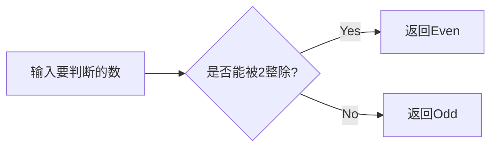
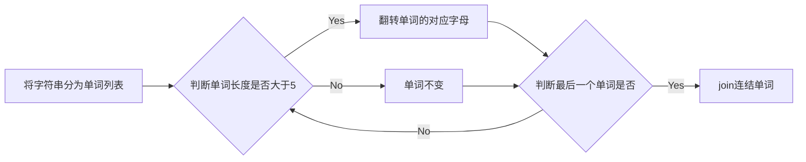
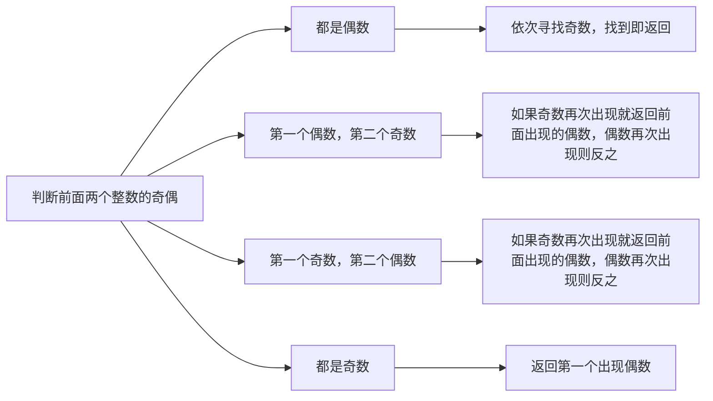
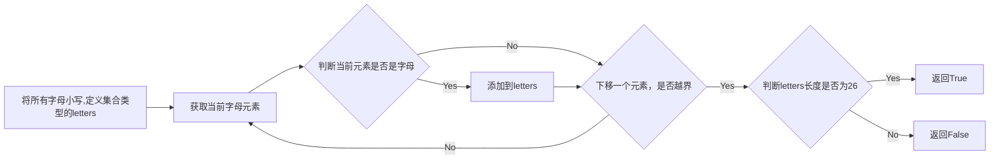
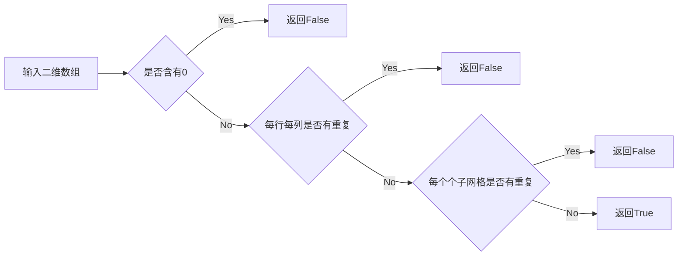

# 实验五 Python数据结构与数据模型

班级： 21计科4班

学号： B20210202307

姓名： 左莉

Github地址：<https://github.com/1128zl/git_python_practice>

CodeWars地址：<https://www.codewars.com/users/1128zl>

## 实验目的

1\. 学习Python数据结构的高级用法

2\. 学习Python的数据模型

## 实验环境

1\. Git

2\. Python 3.10

3\. VSCode

4\. VSCode插件

## 实验内容和步骤

### 第一部分

#### 第一题：停止逆转我的单词

难度： 6kyu

编写一个函数，接收一个或多个单词的字符串，并返回相同的字符串，但所有5个或更多的字母单词都是相反的（就像这个Kata的名字一样）。传入的字符串将只由字母和空格组成。只有当出现一个以上的单词时，才会包括空格。 例如：

spinWords( "Hey fellow warriors" ) => returns "Hey wollef sroirraw" 
spinWords( "This is a test") => returns "This is a test" 
spinWords( "This is another test" )=> returns "This is rehtona test"
代码提交地址： <https://www.codewars.com/kata/5264d2b162488dc400000001>

提示：

* 利用str的split方法可以将字符串分为单词列表 例如：

```python
words = "hey fellow warrior".split()
# words should be ['hey', 'fellow', 'warrior']
```

* 利用列表推导将长度大于等于5的单词反转(利用切片word[::-1])

* 最后使用str的join方法连结列表中的单词。

#### 第二题： 发现离群的数(Find The Parity Outlier)

难度：6kyu

给你一个包含整数的数组（其长度至少为3，但可能非常大）。该数组要么完全由奇数组成，要么完全由偶数组成，除了一个整数N。请写一个方法，以该数组为参数，返回这个 "离群 "的N。

例如：

```python
[2, 4, 0, 100, 4, 11, 2602, 36]
# Should return: 11 (the only odd number)

[160, 3, 1719, 19, 11, 13, -21]
# Should return: 160 (the only even number)
```

代码提交地址： <https://www.codewars.com/kata/5526fc09a1bbd946250002dc>

#### 第三题： 检测Pangram

难度：6kyu

pangram是一个至少包含每个字母一次的句子。例如，"The quick brown fox jumps over the lazy dog "这个句子就是一个pangram，因为它至少使用了一次字母A-Z（大小写不相关）。

给定一个字符串，检测它是否是一个pangram。如果是则返回True，如果不是则返回False。忽略数字和标点符号。 代码提交地址： <https://www.codewars.com/kata/545cedaa9943f7fe7b000048>

#### 第四题： 数独解决方案验证

难度：6kyu

数独背景

数独是一种在 9x9 网格上进行的游戏。游戏的目标是用 1 到 9 的数字填充网格的所有单元格，以便每一列、每一行和九个 3x3 子网格（也称为块）中的都包含数字 1 到 9。更多信息请访问：<http://en.wikipedia.org/wiki/Sudoku>

编写一个函数接受一个代表数独板的二维数组，如果它是一个有效的解决方案则返回 true，否则返回 false。数独板的单元格也可能包含 0，这将代表空单元格。包含一个或多个零的棋盘被认为是无效的解决方案。棋盘总是 9 x 9 格，每个格只包含 0 到 9 之间的整数。

代码提交地址： <https://www.codewars.com/kata/63d1bac72de941033dbf87ae>

#### 第五题： 疯狂的彩色三角形

难度： 2kyu

一个彩色的三角形是由一排颜色组成的，每一排都是红色、绿色或蓝色。连续的几行，每一行都比上一行少一种颜色，是通过考虑前一行中的两个相接触的颜色而产生的。如果这些颜色是相同的，那么新的一行就使用相同的颜色。如果它们不同，则在新的一行中使用缺失的颜色。这个过程一直持续到最后一行，只有一种颜色被生成。

例如：

```python
Colour here:            G G        B G        R G        B R
Becomes colour here:     G          R          B          G
```

一个更大的三角形例子：

```python
R R G B R G B B
 R B R G B R B
  G G B R G G
   G R G B G
    B B R R
     B G R
      R B
       G
```

你将得到三角形的第一行字符串，你的工作是返回最后的颜色，这将出现在最下面一行的字符串。在上面的例子中，你将得到 "RRGBRGBB"，你应该返回 "G"。 限制条件： 1 <= length(row) <= 10 ** 5 输入的字符串将只包含大写字母'B'、'G'或'R'。

例如：

```python
triangle('B') == 'B'
triangle('GB') == 'R'
triangle('RRR') == 'R'
triangle('RGBG') == 'B'
triangle('RBRGBRB') == 'G'
triangle('RBRGBRBGGRRRBGBBBGG') == 'G'
```

代码提交地址： <https://www.codewars.com/kata/5a331ea7ee1aae8f24000175>

提示：请参考下面的链接，利用三进制的特点来进行计算。 <https://stackoverflow.com/questions/53585022/three-colors-triangles>

### 第二部分

使用Mermaid绘制程序流程图

安装VSCode插件：

Markdown Preview Mermaid Support
Mermaid Markdown Syntax Highlighting
使用Markdown语法绘制你的程序绘制程序流程图（至少一个），Markdown代码如下：

程序流程图



使用Markdown编辑器（例如VScode）编写本次实验的实验报告，包括实验过程与结果、实验考查和实验总结，并将其导出为 PDF格式 来提交。

## 实验过程与结果

请将实验过程与结果放在这里，包括：

### 第一部分 Codewars Kata挑战

第一题：

```python
def spin_words(sentence):
    # Your code goes here
    words=sentence.split()
    for index in range(len(words)):
        if(len(words[index])>=5):
            words[index]=words[index][::-1]
    sentence=" ".join(words)
    return sentence
```

第二题：

```python
def find_outlier(integers):
    length = len(integers)

    if integers[0] % 2 == 0 and integers[1] % 2 == 0:
        for index in range(2, length):
            if integers[index] % 2 != 0:
                return integers[index]
        
    elif integers[0] % 2 == 0 and integers[1] % 2 != 0:
        if integers[2] % 2 == 0:
            return integers[1]
        else:
            return integers[0]
    
    elif integers[0] % 2 != 0 and integers[1] % 2 == 0:
        if integers[2] % 2 == 0:
            return integers[0]
        else:
            return integers[1]
    
    else:
        for index in range(2, length):
            if integers[index] % 2 == 0:
                return integers[index]
                
    return None
    
```

第三题：

```python
def is_pangram(s):
    s = s.lower()
    letters = set()

    for c in s:
        if c.isalpha():
            letters.add(c)
    if(len(letters) == 26):
        return True
    return False

```

第四题：

```python
def validate_sudoku(board):
    numbers = set(['1', '2', '3', '4', '5', '6', '7', '8', '9'])
    if 0 in board:
        return False

    for i in range(9):
        row_nums = set(board[i])
        col_nums = set([board[j][i] for j in range(9)])
        if not row_nums.issubset(numbers) or not col_nums.issubset(numbers):
            return False

    subarrays = []
    for i in range(0, 9, 3):
        for j in range(0, 9, 3):
            subarray = [board[x][y] for x in range(i, i+3) for y in range(j, j+3)]
            subarray_nums = set(subarray)
            if not subarray_nums.issubset(numbers):
                return False
    return True

```

第五题：

### 第二部分 使用Mermaid绘制程序流程图

第一题：



第二题：



第三题：



第四题：




第五题：

注意代码需要使用markdown的代码块格式化，例如Git命令行语句应该使用下面的格式：

Git命令

显示效果如下：

```python
git init
git add .
git status
git commit -m "first commit"
```

Python代码

显示效果如下：

```python
def add_binary(a,b):
    return bin(a+b)[2:]
```

代码运行结果的文本可以直接粘贴在这里。

注意：不要使用截图，因为Markdown文档转换为Pdf格式后，截图会无法显示。

实验考查
请使用自己的语言并使用尽量简短代码示例回答下面的问题，这些问题将在实验检查时用于提问和答辩以及实际的操作。

集合（set）类型有什么特点？它和列表（list）类型有什么区别？

集合类型的特点：唯一性（集合中的元素是唯一的），无序性（集合中的元素没有固定顺序），快速成员检查。

和列表类型的区别：集合类型与列表类型的主要区别在于唯一性、有序性和可变性。如果您需要存储一组元素，并确保它们的唯一性以及高效的成员检查操作，那么集合是一个更好的选择。而如果您关注元素的顺序以及允许重复元素，或者需要频繁对元素进行增删改操作，那么列表更适合。

集合（set）类型主要有那些操作？

操作：添加元素，删除元素，成员检查，集合大小，清空集合等。

使用*操作符作用到列表上会产生什么效果？为什么不能使用*操作符作用到嵌套的列表上？使用简单的代码示例说明。

在Python中，使用*操作符可以将列表（List）进行重复操作。

但是，当我们尝试对嵌套的列表进行重复操作时，使用*操作符并不会得到我们期望的结果。这是因为*操作符只是简单地对列表进行重复，而不会创建新的嵌套结构。

总结列表,集合，字典的解析（comprehension）的使用方法。使用简单的代码示例说明。

## 实验总结

在本次的实验过程中，新学习了集合类型，了解到在之前碰到的一些题目中，如果采用集合类型，会更便于我们的操作。