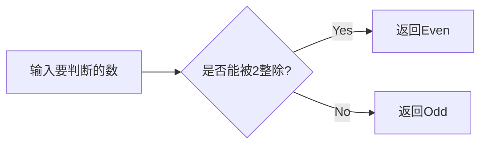
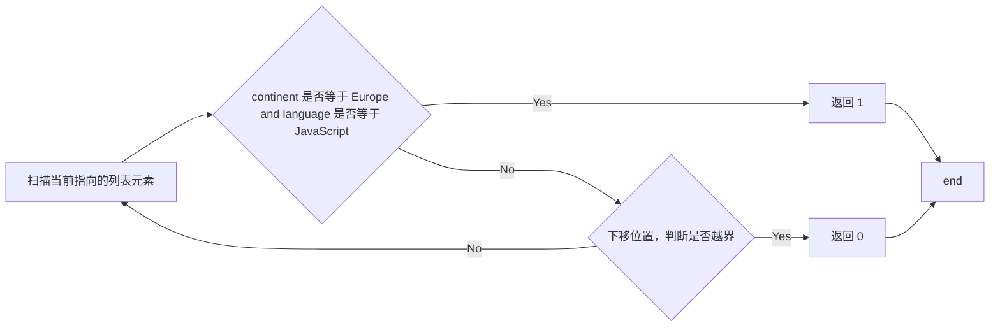
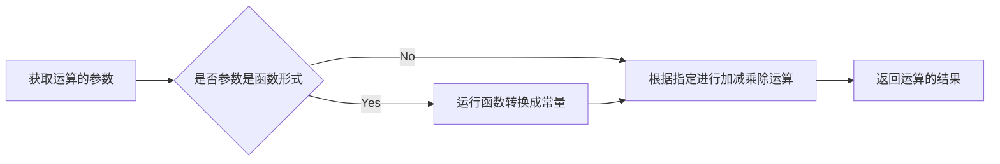
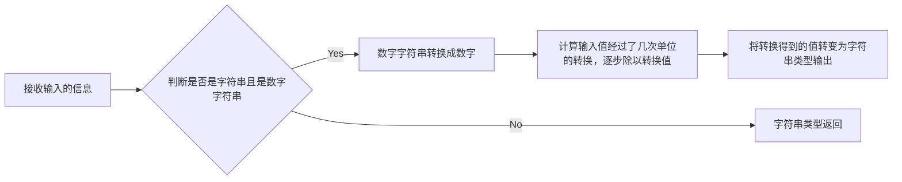
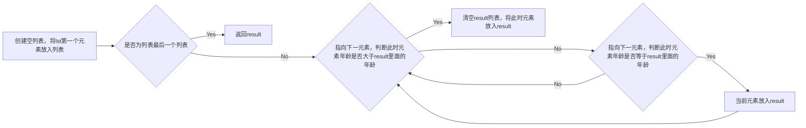

# 实验四 Python函数

班级： 21计科4班

学号： B20210202307

姓名： 左莉

Github地址：<https://github.com/1128zl/git_python_practice>

CodeWars地址：<https://www.codewars.com/users/1128zl>

## 实验目的

1\. 学习Python函数的基本用法

2\. 学习lambda函数和高阶函数的使用

3\. 掌握函数式编程的概念和实践

## 实验环境

1\. Git

2\. Python 3.10

3\. VSCode

4\. VSCode插件

## 实验内容和步骤

### 第一部分

Python函数

完成教材《Python编程从入门到实践》下列章节的练习：

* 第8章 函数

### 第二部分

在Codewars网站注册账号，完成下列Kata挑战：

第一题：招募志愿者1
入口： 7kyu

你将得到一个字典数据库，代表关于首次报名参加你所组织的编码聚会的开发者的数据。你的任务是返回来自欧洲的JavaScript开发者的数量。例如，给出定以下列表：

```python

lst1 = [
  { 'firstName': 'Noah', 'lastName': 'M.', 'country': 'Switzerland', 'continent': 'Europe', 'age': 19, 'language': 'JavaScript' },
  { 'firstName': 'Maia', 'lastName': 'S.', 'country': 'Tahiti', 'continent': 'Oceania', 'age': 28, 'language': 'JavaScript' },
  { 'firstName': 'Shufen', 'lastName': 'L.', 'country': 'Taiwan', 'continent': 'Asia', 'age': 35, 'language': 'HTML' },
  { 'firstName': 'Sumayah', 'lastName': 'M.', 'country': 'Tajikistan', 'continent': 'Asia', 'age': 30, 'language': 'CSS' }
]
```

你的函数应该返回数字1。如果，没有来自欧洲的JavaScript开发人员，那么你的函数应该返回0。

注意：字符串的格式始终是“Europe”和“JavaScript”。所有的数据将始终是有效的和统一的，如上面的例子。

这个卡塔是Coding Meetup系列的一部分，其中包括一些简单易行的卡塔，这些卡塔是为了让大家掌握高阶函数的使用。在Python中，这些方法包括： , , 。当然也filter可以map采用reduce其他解决这些卡塔的方法。

代码提交地址:<https://www.codewars.com/kata/582746fa14b3892727000c4f>

第二题：使用函数进行计算
入口：5kyu

现在我们想用函数来写计算，并得到结果。让我们看一些例子：

```python

seven(times(five())) # must return 35
four(plus(nine())) # must return 13
eight(minus(three())) # must return 5
six(divided_by(two())) # must return 3
```

要求：

从0（“零”）到9（“九”）的每个数字都必须有一个函数。
必须有一个用于以下数学攻击的函数：加、减、乘、除。
每次计算都由一个操作和两个数字组成。
最外面的函数代表左边的操作数，最里面的函数代表右边的操作数。
除法应该是整数除法。
例如，下面的计算应该返回2，而不是2.666666...。

```python
eight(divided_by(three()))
```

代码提交地址： <https://www.codewars.com/kata/525f3eda17c7cd9f9e000b39>

第三题： 总量数值的过滤器(Number Shortening Filter)
入口：6kyu

在这个kata中，我们将创建一个函数，它返回另一个前面长数字的函数。给定一个初始值阵列替换给定基数的X次方。返回如果函数的输入不是数字字符串，则应将输入本身作为字符串返回。

例子：

```python
filter1 = shorten_number(['','k','m'],1000)
filter1('234324') == '234k'
filter1('98234324') == '98m'
filter1([1,2,3]) == '[1,2,3]'
filter2 = shorten_number(['B','KB','MB','GB'],1024)
filter2('32') == '32B'
filter2('2100') == '2KB';
filter2('pippi') == 'pippi'
```

代码提交地址： <https://www.codewars.com/kata/56b4af8ac6167012ec00006f>

第四题：编码队伍7
入口： 6kyu

您将获得一个对象序列，表示已注册参加您组织的下一个编程聚会的开发人员的数据。

您的任务是返回一个序列，其中包括最长的开发人员。如果有多个开发人员年龄相同，则将他们按照在原始输入阵列中出现的顺序排序。

例如，给定以下输入存储：

```python
list1 = [
  { 'firstName': 'Gabriel', 'lastName': 'X.', 'country': 'Monaco', 'continent': 'Europe', 'age': 49, 'language': 'PHP' },
  { 'firstName': 'Odval', 'lastName': 'F.', 'country': 'Mongolia', 'continent': 'Asia', 'age': 38, 'language': 'Python' },
  { 'firstName': 'Emilija', 'lastName': 'S.', 'country': 'Lithuania', 'continent': 'Europe', 'age': 19, 'language': 'Python' },
  { 'firstName': 'Sou', 'lastName': 'B.', 'country': 'Japan', 'continent': 'Asia', 'age': 49, 'language': 'PHP' },
]
```

您的程序应返回以下结果：

```python
[
  { 'firstName': 'Gabriel', 'lastName': 'X.', 'country': 'Monaco', 'continent': 'Europe', 'age': 49, 'language': 'PHP' },
  { 'firstName': 'Sou', 'lastName': 'B.', 'country': 'Japan', 'continent': 'Asia', 'age': 49, 'language': 'PHP' },
]
```

注意：

输入的列表永远都包含像示例中一样有效的正确格式的数据，而且永远不会为空。
代码提交地址： <https://www.codewars.com/kata/582887f7d04efdaae3000090>

第五题：柯里化与部分应用
入口： 4kyu

柯里化与部分应用能够将一个函数转换为具有更小数量（参数更少）的另一个函数的两种方法。虽然它们经常被混淆，但它们的工作方式是不同的。目标是学会区分它们。

柯里化

是一种将接受多个参数的函数转换为每个参数都只接受一个参数的一系列函数链的技术。

柯里化接受一个函数：

```python
f：X × Y → R
```

将其转换为一个函数：

```python
f'：X → (Y → R)
```

我们不再使用两个参数调用f，而是使用第一个参数调用f'。结果是一个函数，然后我们使用第二个参数调用该函数来产生结果。因此，如果非柯里化f被调用为：

```python
f(3, 5)
```

现在 curried f' 被调用为：

```python
f'(3)(5)
```

示例给出以下函数：

```python
def add(x, y, z):
  return x + y + z
```

我们可以以普通方式调用：

```python
add(1, 2, 3) # => 6
```

但我们可以创建一个柯里化版本的 add(a, b, c) 函数：

```python
curriedAdd = lambda a: (lambda b: (lambda c: add(a,b,c)))
curriedAdd(1)(2)(3) # => 6
```

偏应用将一定数量的参数固定到函数中，从而产生另一个更小的（参数更少）的函数的过程。

部分应用接受一个函数：

```python
f：X × Y → R
```

和一个固定值x作为第一个参数，产生一个新的函数

```python
f'：Y → R
```

f'与f执行相同的操作，但只填写需要第二个参数，这就是其arity比f的arity少一个原因。可以说第一个参数绑定到x。

示例：

```python
partialAdd = lambda a: (lambda *args: add(a,*args))
partialAdd(1)(2, 3) # => 6
```

你的任务是实现一个名为curryPartial()的通用函数，可以进行currying或部分应用。

例如：

```python
curriedAdd = curryPartial(add)
curriedAdd(1)(2)(3) # => 6

partialAdd = curryPartial(add, 1)
partialAdd(2, 3) # => 6
```

我们希望功能保持灵活。

下面所有这些例子都应该产生相同的结果：

```python
curryPartial(add)(1)(2)(3) # =>6 
curryPartial(add, 1)(2)(3) # =>6 
curryPartial(add, 1)(2, 3) # =>6 
curryPartial(add, 1, 2)(3) # =>6 
curryPartial(add, 1, 2, 3) # =>6 
curryPartial(add)(1, 2, 3) # =>6 
curryPartial(add)(1, 2)(3) # =>6 
curryPartial(add)()(1, 2, 3) # =>6 
curryPartial(add)()(1)()()(2)(3) # =>6 

curryPartial(add)()(1)()()(2)(3, 4, 5, 6) # =>6 
curryPartial(add, 1)(2, 3, 4, 5) # =>6 

curryPartial(curryPartial(curryPartial(add, 1), 2), 3) # =>6
curryPartial(curryPartial(add, 1, 2), 3) # =>6
curryPartial(curryPartial(add, 1), 2, 3) # =>6
curryPartial(curryPartial(add, 1), 2)(3) # =>6
curryPartial(curryPartial(add, 1)(2), 3) # =>6
curryPartial(curryPartial(curryPartial(add, 1)), 2, 3) # =>6
```

代码提交地址： <https://www.codewars.com/kata/53cf7e37e9876c35a60002c9>

#### 第三部分

使用Mermaid绘制程序流程图

安装VSCode插件：

Markdown Preview Mermaid Support
Mermaid Markdown Syntax Highlighting
使用Markdown语法绘制你的程序绘制程序流程图（至少一个），Markdown代码如下：

程序流程图



查看美人鱼流程图语法--><点击这里>

使用Markdown编辑器（例如VScode）编写本次实验的实验报告，包括实验过程与结果、实验考查和实验总结，并将其导出为 PDF格式 来提交。

## 实验过程与结果

提交实验过程与结果放在这里，包括：

第一部分 Python 函数

喜欢的书

```python
def favorite_book(title):
    print(f"One of my favorite books is {title}.\n")
    
favorite_book('the king')
```

城市

```python
country='China'
cities=['beijing','shanghai','shenzhen']
def describe_country(country,city):
    if city.lower() in cities : 
        print(f"{city.title()} is in {country.title()}.\n")
    

describe_country(country,'shanghai')
describe_country(country,'Beijing')
describe_country(country,'shouer')
```

专辑

```python
def make_album(s_name,c_name,count=''):
    albums={}
    albums['singer']=s_name
    albums['cd']=c_name
    
    if(count!=''):
        albums['number']=count
    return albums

#print(make_album('邓紫棋','启示录'))
#print(make_album('易烊千玺','刘艳芬',8))
#print(make_album('王源','客厅狂欢'))
'


def user_create():
    for i in range(3):
        print("\nPlease input two messages:\n")
        s_name=input("signer name :")
        c_name=input("\ncd name :")
        print(make_album(s_name,c_name))
        
        
user_create()
```

消息

```python
messages=['how are you?','I am fine.','Good night!']
def show_messages():
    for message in messages:
        print(message)

send_messages=[]       
def send_messages_fun():
    for message in messages:
        send_messages.append(message)
        
show_messages()
send_messages_fun()
for message in send_messages:
        print(message)
```

汽车

```python
def make_car(manuf,type,**car_info):
    car_info['制造商']=manuf
    car_info['型号']=type
    return car_info
print(make_car('比亚迪','型号1',color='green',value='200000'))
```

文件导入

外部文件

```python
def describe():
    print("Today is a good day!")
```

```python
'''
from six_practice_2 import *
print("What do you think of today?\n")
describe()
'''
'''
import six_practice_2
six_practice_2.describe()
'''

from six_practice_2 import describe
print("What do you think of today?\n")
describe()
```

第二部分 Codewars Kata 挑战

第一题：

```python
def count_developers(lst):
    # Your code here
    signal=0
    for i in range(len(lst)):
        for key,value in lst[i].items():
            if key=='continent' and value=='Europe':
                signal+=1
            if key== 'language' and value=='JavaScript':
                signal+=1
        if signal==2:
            return 1
    return 0
    pass

```

第二题：

```python
def zero(func=None): 
    if func==None:
        return 0
    else :
        return func(0)

def one(func=None): 
    if func==None:
        return 1
    else :
        return func(1)
def two(func=None): 
    if func is None:
        return 2
    else :
        return func(2)
#your code here
def three(func=None):
    if func is None:
        return 3
    else :
        return func(3)
def four(func=None): 
    if func is None:
        return 4
    else :
        return func(4)
    
def five(func=None): 
    if func is None:
        return 5
    else :
        return func(5)
    
def six(func=None): 
    if func is None:
        return 6
    else :
        return func(6)
def seven(func=None): 
    if func is None:
        return 7
    else :
        return func(7)
    
def eight(func=None): 
    if func is None:
        return 8
    else :
        return func(8)
def nine(func=None): 
    if func is None:
        return 9
    else :
        return func(9)

def plus(y): 
    return lambda x: x + y
def minus(y): 
    return lambda x: x - y
def times(y):
    return lambda x: x * y
def divided_by(y):  
    return lambda x: x / y
```

第三题：

```python
def shorten_number(suffixes, base):
    def filter1(input):
        if isinstance(input, str) and input.isdigit():
            number=int(input)
            count=0
            while(number>=base):
                number/=base
                count+=1
            return '{:.0f}{}'.format(number, suffixes[count])
        else:
            return str(input)
    return filter1
```

第四题：

```python
def find_senior(lst): 
    # your code here
    result=[]
    result.append(lst[0])
    mage=lst[0]['age']
    for i in range(1,len(lst)):
        for key,value in lst[i].items():
            if key=='age' and value>mage:
                result=[]
                result.append(lst[i])
            elif key=='age' and value==mage:
                result.append(lst[i])
            
    return result
    pass
```

第五题：

```python

```

第三部分 使用美人鱼较差程序流程图

第一题：



第二题：



第三题：



第四题：



注意代码需要使用markdown的代码块格式化，例如Git命令行语句应该使用下面的格式：

Git命令

显示效果如下：

```python
git init
git add .
git status
git commit -m "first commit"
```

如果是Python代码，应该使用下面代码块格式，例如：

Python代码

显示效果如下：

```python
def add_binary(a,b):
    return bin(a+b)[2:]
```

代码运行结果的文本可以直接粘贴在这里。

注意：不要使用截图，Markdown文档转换为Pdf格式后，截图可能无法显示。

## 实验考查

请使用自己的语言并使用一个简单的代码示例回答下面的问题，这些问题将在实验检查时用于提问和解答逻辑以及实际的操作。

什么是函数式编程范式？

函数式编程范式（Functional Programming Paradigm）是一种编程范式，其中函数被视为第一等公民（first-class citizens）。这意味着函数可以像变量一样被传递和操作，函数可以接受其他函数作为参数或返回函数作为结果。函数式编程强调使用纯函数（Pure Functions）来编写程序，避免共享状态和可变数据，从而减少副作用和改变系统状态的可能性。

什么是lambda函数？请简单说明。

lambda函数是函数式编程中的一种匿名函数（Anonymous Function），它可以在需要时被定义和使用，而无需给它们命名。lambda函数通常是简短且只在特定上下文中使用。它们由关键字lambda引导，并且可以接受任意数量的参数，但只能有一个表达式作为函数体。lambda函数的语法形式类似于：lambda arguments: expression。

什么是高阶函数？常用的高阶函数有哪些？这些高阶函数如何工作？使用简单的代码示例说明。

高阶函数（Higher-order Functions）是函数式编程中的概念，它们可以接受一个或多个函数作为参数，并/或返回一个函数作为结果。简单来说，高阶函数可以操作其他函数。常用的高阶函数包括map、filter和reduce。

map函数接受一个函数和一个可迭代对象作为参数，然后对可迭代对象中的每个元素应用该函数，并返回一个新的可迭代对象，其中包含应用函数后的结果。

```python
numbers = [1, 2, 3, 4, 5]
doubled_numbers = list(map(lambda x: x * 2, numbers))
print(doubled_numbers)  # 输出 [2, 4, 6, 8, 10]
```

filter函数接受一个函数和一个可迭代对象作为参数，然后使用该函数对可迭代对象中的每个元素进行过滤，并返回一个新的可迭代对象，其中只包含满足条件的元素。例如，从一个列表中筛选出所有的偶数：

```python
numbers = [1, 2, 3, 4, 5]
even_numbers = list(filter(lambda x: x % 2 == 0, numbers))
print(even_numbers)  # 输出 [2, 4]

```

## 实验总结

数据结构：实验涉及处理和展示数据，因此我了解和运用了不同的数据结构，例如列表、字典和元组。我学习了如何有效地组织和操作这些数据结构，以便进行数据处理和呈现。
