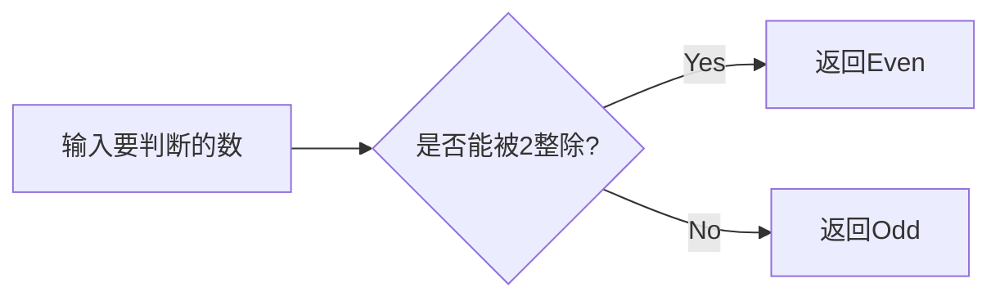
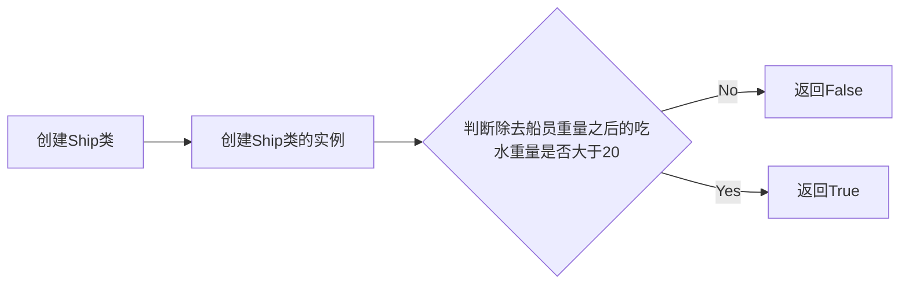
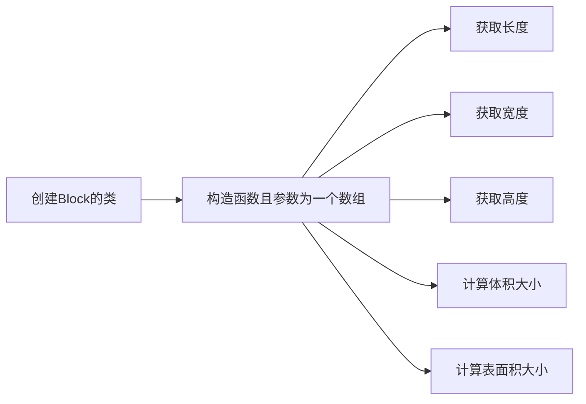
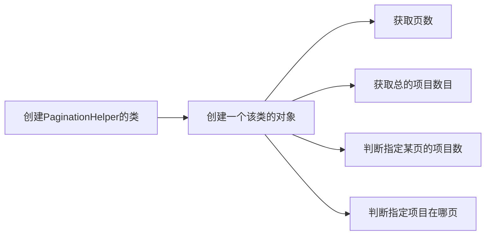
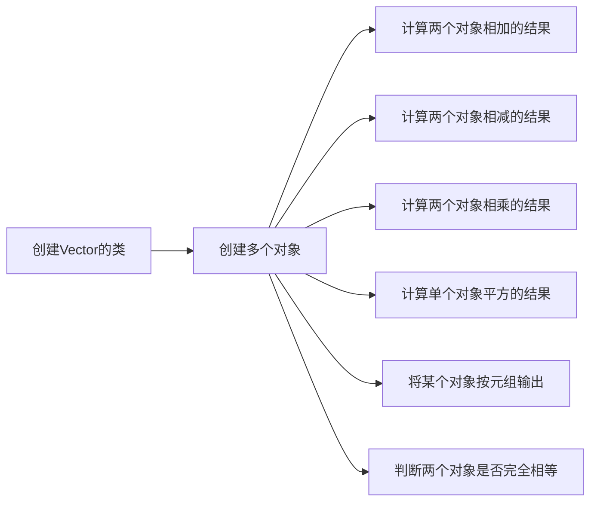

# 实验七 Python面向对象编程

班级： 21计科4班

学号： B20210202307

姓名： 左莉

Github地址：<https://github.com/1128zl/git_python_practice>

CodeWars地址：<https://www.codewars.com/users/1128zl>

## 实验目的

1\. 学习Python类和继承的基础知识

2\. 学习namedtuple和DataClass的使用

## 实验环境

1\. Git

2\. Python 3.10

3\. VSCode

4\. VSCode插件

## 实验内容和步骤

### 第一部分

Python面向对象编程

完成教材《Python编程从入门到实践》下列章节的练习：

* 第9章 类

### 第二部分

在Codewars网站注册账号，完成下列Kata挑战：

第一题：面向对象的海盗
难度： 8kyu

啊哈，伙计!

你是一个小海盗团的首领。而且你有一个计划。在OOP的帮助下，你希望建立一个相当有效的系统来识别船上有大量战利品的船只。 对你来说，不幸的是，现在的人很重，那么你怎么知道一艘船上装的是黄金而不是人呢？

你首先要写一个通用的船舶类。

```python
class Ship:
    def __init__(self, draft, crew):
        self.draft = draft
        self.crew = crew
```

每当你的间谍看到一艘新船进入码头，他们将根据观察结果创建一个新的船舶对象。

draft吃水 - 根据船在水中的高度来估计它的重量
crew船员 - 船上船员的数量
Titanic = Ship(15, 10)

任务

你可以访问船舶的 "draft(吃水) "和 "crew(船员)"。"draft(吃水) "是船的总重量，"船员 "是船上的人数。 每个船员都会给船的吃水增加1.5个单位。如果除去船员的重量后，吃水仍然超过20，那么这艘船就值得掠夺。任何有这么重的船一定有很多战利品! 添加方法 is_worth_it 来决定这艘船是否值得掠夺。

例如：

```python
Titanic.is_worth_it()
False
```

祝你好运，愿你能找到金子!

代码提交地址： <https://www.codewars.com/kata/54fe05c4762e2e3047000add>

第二题： 搭建积木
难度：7kyu

写一个创建Block的类（Duh.） 构造函数应该接受一个数组作为参数，这个数组将包含3个整数，其形式为[width, length, height]，Block应该由这些整数创建。

定义这些方法:

```python
get_width() return the width of the Block
get_length() return the length of the Block
get_height() return the height of the Block
get_volume() return the volume of the Block
get_surface_area() return the surface area of the Block
```

例子：

```python
b = Block([2,4,6]) # create a `Block` object with a width of `2` a length of `4` and a height of `6`
b.get_width() # return 2    
b.get_length() # return 4
b.get_height() # return 6
b.get_volume() # return 48
b.get_surface_area() # return 88
```

注意： 不需要检查错误的参数。

代码提交地址： <https://www.codewars.com/kata/55b75fcf67e558d3750000a3>

第三题： 分页助手
难度：5kyu

在这个练习中，你将加强对分页的掌握。你将完成PaginationHelper类，这是一个实用类，有助于查询与数组有关的分页信息。 该类被设计成接收一个值的数组和一个整数，表示每页允许多少个项目。集合/数组中包含的值的类型并不相关。

下面是一些关于如何使用这个类的例子：

```python
helper = PaginationHelper(['a','b','c','d','e','f'], 4)
helper.page_count() # should == 2
helper.item_count() # should == 6
helper.page_item_count(0)  # should == 4
helper.page_item_count(1) # last page - should == 2
helper.page_item_count(2) # should == -1 since the page is invalid

# page_index takes an item index and returns the page that it belongs on
helper.page_index(5) # should == 1 (zero based index)
helper.page_index(2) # should == 0
helper.page_index(20) # should == -1
helper.page_index(-10) # should == -1 because negative indexes are invalid
```

代码提交地址： <https://www.codewars.com/kata/515bb423de843ea99400000a>

第四题： 向量（Vector）类
难度： 5kyu

创建一个支持加法、减法、点积和向量长度的向量（Vector）类。

举例来说：

```python
a = Vector([1, 2, 3])
b = Vector([3, 4, 5])
c = Vector([5, 6, 7, 8])

a.add(b)      # should return a new Vector([4, 6, 8])
a.subtract(b) # should return a new Vector([-2, -2, -2])
a.dot(b)      # should return 1*3 + 2*4 + 3*5 = 26
a.norm()      # should return sqrt(1^2 + 2^2 + 3^2) = sqrt(14)
a.add(c)      # raises an exception
```

如果你试图对两个不同长度的向量进行加减或点缀，你必须抛出一个错误。 向量类还应该提供：

一个 __str__ 方法，这样 str(a) === '(1,2,3)'
一个equals方法，用来检查两个具有相同成分的向量是否相等。
注意：测试案例将利用用户提供的equals方法。

代码提交地址： https://www.codewars.com/kata/526dad7f8c0eb5c4640000a4

第五题： Codewars风格的等级系统
难度： 4kyu

编写一个名为User的类，用于计算用户在类似于Codewars使用的排名系统中的进步量。

业务规则：

一个用户从等级-8开始，可以一直进步到8。
没有0（零）等级。在-1之后的下一个等级是1。
用户将完成活动。这些活动也有等级。
每当用户完成一个有等级的活动，用户的等级进度就会根据活动的等级进行更新。
完成活动获得的进度是相对于用户当前的等级与活动的等级而言的。
用户的等级进度从零开始，每当进度达到100时，用户的等级就会升级到下一个等级。
在上一等级时获得的任何剩余进度都将被应用于下一等级的进度（我们不会丢弃任何进度）。例外的情况是，如果没有其他等级的进展（一旦你达到8级，就没有更多的进展了）。
一个用户不能超过8级。
唯一可接受的等级值范围是-8,-7,-6,-5,-4,-3,-2,-1,1,2,3,4,5,6,7,8。任何其他的值都应该引起错误。
逻辑案例：

如果一个排名为-8的用户完成了一个排名为-7的活动，他们将获得10的进度。
如果一个排名为-8的用户完成了排名为-6的活动，他们将获得40的进展。
如果一个排名为-8的用户完成了排名为-5的活动，他们将获得90的进展。
如果一个排名-8的用户完成了排名-4的活动，他们将获得160个进度，从而使该用户升级到排名-7，并获得60个进度以获得下一个排名。
如果一个等级为-1的用户完成了一个等级为1的活动，他们将获得10个进度（记住，零等级会被忽略）。
代码案例：

```python
user = User()
user.rank # => -8
user.progress # => 0
user.inc_progress(-7)
user.progress # => 10
user.inc_progress(-5) # will add 90 progress
user.progress # => 0 # progress is now zero
user.rank # => -7 # rank was upgraded to -7
```

代码提交地址： <https://www.codewars.com/kata/51fda2d95d6efda45e00004e>

#### 第三部分

使用Mermaid绘制程序流程图

安装VSCode插件：

Markdown Preview Mermaid Support
Mermaid Markdown Syntax Highlighting
使用Markdown语法绘制你的程序绘制程序流程图（至少一个），Markdown代码如下：

程序流程图



查看美人鱼流程图语法--><点击这里>

使用Markdown编辑器（例如VScode）编写本次实验的实验报告，包括实验过程与结果、实验考查和实验总结，并将其导出为 PDF格式 来提交。

## 实验过程与结果

请将实验过程与结果放在这里，包括：

### 第一部分 Python面向对象编程

用户创建多个用例:

```python
class User:

    def __init__(self, first_name, last_name, age, sex,login_attempts):
        self.first_name = first_name
        self.last_name = last_name
        self.age = age
        self.sex = sex
        self.login_attempts=login_attempts

    def describe_user(self):
        print(f"first_name: {self.first_name}\n")
        print(f"last_name: {self.last_name}\n")
        print(f"age: {self.age}\n")
        print(f"sex: {self.sex}\n")
        print(f"login_attempts: {self.login_attempts}\n")

    def greet_user(self):
        print(f"Hello, {self.last_name} {self.first_name}\n")

        
# 创建用户对象
user1 = User("华", "李", 18, "女",0)
user2 = User("三", "张", 20, "男",0)
user3 = User("四", "赵", 22, "男",0)

# 调用对象的方法
user1.describe_user()
user1.greet_user()
user2.describe_user()
user2.greet_user()

user3.describe_user()
user3.greet_user()
```

```python
class User:

    def __init__(self, first_name, last_name, age, sex,login_attempts):
        self.first_name = first_name
        self.last_name = last_name
        self.age = age
        self.sex = sex
        self.login_attempts=login_attempts

    def describe_user(self):
        print(f"first_name: {self.first_name}\n")
        print(f"last_name: {self.last_name}\n")
        print(f"age: {self.age}\n")
        print(f"sex: {self.sex}\n")
        print(f"login_attempts: {self.login_attempts}\n")

    def greet_user(self):
        print(f"Hello, {self.last_name} {self.first_name}\n")

    def increment_number_served(self,amount):
        self.login_attempts=self.login_attempts+amount
        
    def reset_login_attempts(self,amount):
        self.login_attempts=amount
        
# 创建用户对象
user1 = User("华", "李", 18, "女",0)
user2 = User("三", "张", 20, "男",0)
user3 = User("四", "赵", 22, "男",0)

# 调用对象的方法
user1.describe_user()
user1.greet_user()
user1.increment_number_served(1)
print(f"user1 login_attempts: {user1.login_attempts}\n")

user1.increment_number_served(1)
print(f"user1 login_attempts: {user1.login_attempts}\n")

user1.increment_number_served(1)
print(f"user1 login_attempts: {user1.login_attempts}\n")

user1.reset_login_attempts(0)
print(f"user1 login_attempts: {user1.login_attempts}\n")
```

电池升级：

```PYTHON
class Car:
    def __init__(self, make, model, year):
        self.make = make
        self.model = model
        self.year = year
        self.odometer_reading = 0

    def get_descriptive_name(self):
        long_name = f"{self.year} {self.make} {self.model}"
        return long_name.title()

    def read_odometer(self):
        print(f"This car has {self.odometer_reading} miles on it.")

    def update_odometer(self, mileage):
        if mileage >= self.odometer_reading:
            self.odometer_reading = mileage
        else:
            print("You can't roll back an odometer!")

    def increment_odometer(self, miles):
        self.odometer_reading += miles


class ElectricCar(Car):
    def __init__(self, make, model, year):
        super().__init__(make, model, year)
        self.battery = Battery()


class Battery:
    def __init__(self, battery_size=40):
        self.battery_size = battery_size

    def describe_battery(self):
        print(f"This car has a {self.battery_size}-KWH battery.")

    def upgrade_battery(self):
        if self.battery_size != 65:
            self.battery_size = 65

    def get_range(self):
        if self.battery_size == 40:
            range_ = 150
        elif self.battery_size == 65:
            range_ = 225
        print(f"This car can go about {range_} miles on a full charge.")

electric_car = ElectricCar("Nissan", "Leaf", 2024)

electric_car.battery.get_range()

electric_car.battery.upgrade_battery()

electric_car.battery.get_range()
```

多个模块：

user.py

```python
class User:
    def __init__(self, first_name, last_name, age):
        self.first_name = first_name
        self.last_name = last_name
        self.age = age

    def describe_user(self):
        print(f"{self.first_name} {self.last_name}, {self.age} years old.")
```

admin.py

```python
from privileges import Admin

admin_user = Admin("John", "Doe", 30, ["can add post", "can delete post", "can ban user"])

admin_user.privileges.show_privileges()

```

privileges.py

```python
from user import User

class Privileges:
    def __init__(self, privileges=[]):
        self.privileges = privileges

    def show_privileges(self):
        print("Privileges:")
        for privilege in self.privileges:
            print(f"- {privilege}")

class Admin(User):
    def __init__(self, first_name, last_name, age, privileges=[]):
        super().__init__(first_name, last_name, age)
        self.privileges = Privileges(privileges)
```

彩票：

```python
import random
list=[2,'a',6,'f',9,'g',1,3,5,'t',4,7,0,'o',8]
select=random.sample(list,4)
print(f"If your choice is like to this choice,you will get the prize.")
```

### 第二部分 Codewars Kata挑战

第一题：

```python
class Ship:
    def __init__(self, draft, crew):
        self.draft = draft
        self.crew = crew
    # Your code here
    
    def is_worth_it(self):
        if self.draft-(self.crew*1.5)>20:
            return True
        else :
            return False

Titanic=Ship(15,10)
Titanic.is_worth_it()
```

流程图：



第二题：

```python
class Block:
    
    def __init__(self,list):
        self.width=list[0]
        self.length=list[1]
        self.height=list[2]
        
    def get_width(self):
        return self.width

    def get_length(self):
        return self.length
    
    def get_height(self):
        return self.height
    
    def get_volume(self):
        return self.width*self.length*self.height
    
    def get_surface_area(self):
        return (self.height*self.width+self.width*self.length+self.length*self.height)*2
    
b=Block([2,4,6])
b.get_width()     
b.get_length() 
b.get_height()
b.get_volume()
b.get_surface_area() 
```

流程图：



第三题：

```python
# TODO: complete this class
import math
class PaginationHelper:
    
    # The constructor takes in an array of items and an integer indicating
    # how many items fit within a single page
    def __init__(self, collection, items_per_page):
        self.c=collection
        self. i= items_per_page
        
    
    # returns the number of items within the entire collection
    def item_count(self):
        return len(self.c)
    
    # returns the number of pages
    def page_count(self):
        return math.ceil(len(self.c) / self.i)
    
    # returns the number of items on the given page. page_index is zero based
    # this method should return -1 for page_index values that are out of range
    def page_item_count(self, page_index):
        if len(self.c)-self.i*(page_index+1)>0:
            return self.i
        elif len(self.c)-self.i*(page_index+1)<0 and len(self.c)-self.i*(page_index)>0:
            return len((self.c))-self.i*(page_index)
        else :
            return -1
    
    # determines what page an item at the given index is on. Zero based indexes.
    # this method should return -1 for item_index values that are out of range
    def page_index(self, item_index):
        if(item_index   <=0):
            return -1
        elif(item_index>len(self.c) or item_index<0):
            return -1
        else:
            return item_index//self.i

```

流程图：



第四题：

```python
class Vector:
    def __init__(self, elements):
        self.elements = elements

    def add(self, other):
        if len(self.elements) != len(other.elements):
            raise ValueError("Vectors must have the same length for addition")
        result = [x + y for x, y in zip(self.elements, other.elements)]
        return Vector(result)

    def subtract(self, other):
        if len(self.elements) != len(other.elements):
            raise ValueError("Vectors must have the same length for subtraction")
        result = [x - y for x, y in zip(self.elements, other.elements)]
        return Vector(result)

    def dot(self, other):
        if len(self.elements) != len(other.elements):
            raise ValueError("Vectors must have the same length for dot product")
        result = sum(x * y for x, y in zip(self.elements, other.elements))
        return result

    def norm(self):
        result = sum(x ** 2 for x in self.elements) ** 0.5
        return result

    def __str__(self):
        return f"Vector({self.elements})"

    def equals(self, other):
        if not isinstance(other, Vector):
            return False
        return self.elements == other.elements
```

流程图：



第五题：

```python
class User:
    def __init__(self):
        self.rank = -8
        self.progress = 0

    def validate_rank(self, rank):
        if rank not in [-8, -7, -6, -5, -4, -3, -2, -1, 1, 2, 3, 4, 5, 6, 7, 8]:
            raise ValueError("Invalid rank")

    def inc_progress(self, activity_rank):
        self.validate_rank(activity_rank)

        if self.rank == 8:
            return  # If user is already at the maximum rank, no progress can be made

        rank_difference = activity_rank - self.rank

        if rank_difference == 0:
            self.progress += 3
        elif rank_difference == -1:
            self.progress += 1
        elif rank_difference > 0:
            self.progress += 10 * rank_difference * rank_difference

        while self.progress >= 100:
            self.progress -= 100
            if self.rank < 8:
                self.rank += 1

        # Handle the case where the user goes from rank -1 to rank 1
        if self.rank == -1 and activity_rank == 1:
            self.rank += 2

        if self.rank == 8:
            self.progress = 0
```

### 第三部分 使用Mermaid绘制程序流程图

注意代码需要使用markdown的代码块格式化，例如Git命令行语句应该使用下面的格式：

Git命令

显示效果如下：

```python
git init
git add .
git status
git commit -m "first commit"
```

如果是Python代码，应该使用下面代码块格式，例如：

Python代码

显示效果如下：

```python
def add_binary(a,b):
    return bin(a+b)[2:]
```

代码运行结果的文本可以直接粘贴在这里。

注意：不要使用截图，Markdown文档转换为Pdf格式后，截图可能会无法显示。

## 实验考查

请使用自己的语言并使用尽量简短代码示例回答下面的问题，这些问题将在实验检查时用于提问和答辩以及实际的操作。

Python的类中__init__方法起什么作用？

当你创建一个类的实例时，__init__ 方法会被自动调用，用于对新建对象进行初始化操作。这个方法可以让你在创建对象时传入一些参数，并在对象被创建后执行一些必要的初始化工作。

Python语言中如何继承父类和改写（override）父类的方法。

在 Python 中，继承父类并改写（override）父类的方法非常简单。只需在子类中定义一个与父类方法同名的方法即可，这样就会覆盖（override）父类中的相应方法。

Python类有那些特殊的方法？它们的作用是什么？请举三个例子并编写简单的代码说明。

Python 类中有很多特殊的方法，也被称为魔术方法或特殊方法。这些方法以双下划线开头和结尾，用于实现特定的行为。

__str__ 方法：用于定义对象的打印字符串表示。当使用 print 函数打印对象时，会调用该方法。

```python
class MyClass:
    def __init__(self, value):
        self.value = value

    def __str__(self):
        return f"MyClass with value: {self.value}"

obj = MyClass(42)
print(obj)  # 输出：MyClass with value: 42

```

__len__ 方法：用于定义对象的长度。当使用内置的 len 函数计算对象的长度时，会调用该方法。

```python
class MyList:
    def __init__(self, data):
        self.data = data

    def __len__(self):
        return len(self.data)

lst = MyList([1, 2, 3, 4, 5])
print(len(lst))  # 输出：5
```

__add__ 方法：用于定义对象的加法行为。当对对象执行加法操作时，会调用该方法。

```python
class Point:
    def __init__(self, x, y):
        self.x = x
        self.y = y

    def __add__(self, other):
        return Point(self.x + other.x, self.y + other.y)

p1 = Point(1, 2)
p2 = Point(3, 4)
p3 = p1 + p2
print((p3.x, p3.y))  # 输出：(4, 6)
```

## 实验总结

本次实验主要学习了面向对象的编程的相关知识点，包括如何创建对象，引用方法。另外，在本次的卡塔挑战中，对于前面的知识点也有了运用。比如向下取整，向上取整等。

