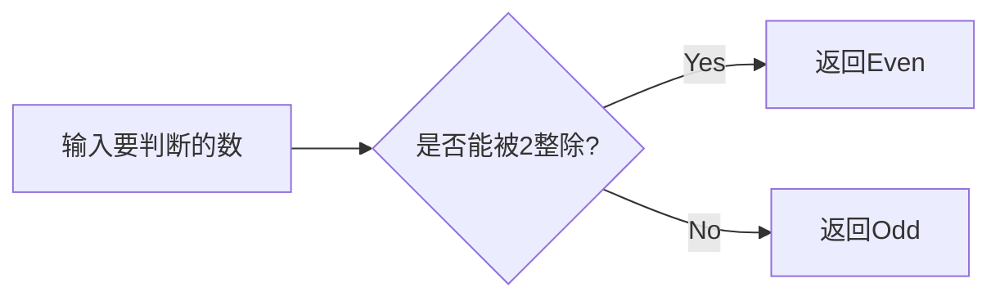
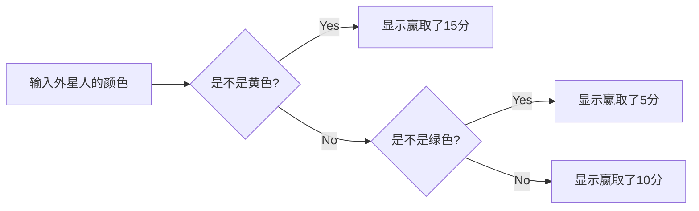

# 实验三 Python列表

班级： 21计科4班

学号： B20210202307

姓名： 左莉

Github地址：<https://github.com/1128zl/git_python_practice>

CodeWars地址：<https://www.codewars.com/users/1128zl>

## 实验目的

1\. 学习Python的简单使用和列表操作

2\.学习Python中的if语句

## 实验环境

1\. Git

2\. Python 3.10

3\. VSCode

4\. VSCode插件

## 实验内容和步骤

### 第一部分

Python列表操作

完成教材《Python编程从入门到实践》下列章节的练习：

* 第3章 列表简介
* 第4章 操作列表
* 第5章 if语句

### 第二部分

在Codewars网站注册账号，完成下列Kata挑战：

第一题：3和5的倍数（Multiples of 3 or 5）
难度： 6kyu

如果我们列出所有低于 10 的 3 或 5 倍数的自然数，我们得到 3、5、6 和 9。这些数的总和为 23. 完成一个函数，使其返回小于某个整数的所有是3 或 5 的倍数的数的总和。此外，如果数字为负数，则返回 0。

注意：如果一个数同时是3和5的倍数，应该只被算一次。

提示：首先使用列表解析得到一个列表，元素全部是3或者5的倍数。 使用sum函数可以获取这个列表所有元素的和.

代码提交地址： <https://www.codewars.com/kata/514b92a657cdc65150000006>

第二题： 重复字符的编码器（Duplicate Encoder）
难度： 6kyu

本练习的目的是将一个字符串转换为一个新的字符串，如果新字符串中的每个字符在原字符串中只出现一次，则为"("，如果该字符在原字符串中出现多次，则为")"。在判断一个字符是否是重复的时候，请忽略大写字母。

例如:

```python
"din"      =>  "((("
"recede"   =>  "()()()"
"Success"  =>  ")())())"
"(( @"     =>  "))(("
```

代码提交地址: <https://www.codewars.com/kata/54b42f9314d9229fd6000d9c>

第三题：括号匹配（Valid Braces）
难度：6kyu

写一个函数，接收一串括号，并确定括号的顺序是否有效。如果字符串是有效的，它应该返回True，如果是无效的，它应该返回False。 例如：

```python
"(){}[]" => True 
"([{}])" => True
 "(}" => False
 "[(])" => False 
"[({})](]" => False
```

提示： python中没有内置堆栈数据结构，可以直接使用list来作为堆栈，其中append方法用于入栈，pop方法可以出栈。

代码提交地址 <https://www.codewars.com/kata/5277c8a221e209d3f6000b56>

第四题： 从随机三元组中恢复秘密字符串(Recover a secret string from random triplets)
难度： 4kyu

有一个不为你所知的秘密字符串。给出一个随机三个字母的组合的集合，恢复原来的字符串。

这里的三个字母的组合被定义为三个字母的序列，每个字母在给定的字符串中出现在下一个字母之前。"whi "是字符串 "whatisup "的一个三个字母的组合。

作为一种简化，你可以假设没有一个字母在秘密字符串中出现超过一次。

对于给你的三个字母的组合，除了它们是有效的三个字母的组合以及它们包含足够的信息来推导出原始字符串之外，你可以不做任何假设。特别是，这意味着秘密字符串永远不会包含不出现在给你的三个字母的组合中的字母。

测试用例：

```python
secret = "whatisup"
triplets = [
  ['t','u','p'],
  ['w','h','i'],
  ['t','s','u'],
  ['a','t','s'],
  ['h','a','p'],
  ['t','i','s'],
  ['w','h','s']
]
test.assert_equals(recoverSecret(triplets), secret)

```

代码提交地址： <https://www.codewars.com/kata/53f40dff5f9d31b813000774/train/python>

提示：

* 利用集合去掉triplets中的重复字母，得到字母集合letters，最后的secret应该由集合中的字母组成，secret长度也等于该集合。

```python
letters = {letter for triplet in triplets for letter in triplet }
length = len(letters)
```

* 创建函数check_first_letter(triplets, first_letter)，检测一个字母是不是secret的首字母，返回True或者False。
* 创建函数remove_first_letter(triplets, first_letter), 从三元组中去掉首字母，返回新的三元组。
* 遍历字母集合letters，利用上面2个函数得到最后的结果secret。

第五题： 去掉喷子的元音（Disemvowel Trolls）
难度： 7kyu

喷子正在攻击你的评论区! 处理这种情况的一个常见方法是删除喷子评论中的所有元音(字母：a,e,i,o,u)，以消除威胁。 你的任务是写一个函数，接收一个字符串并返回一个去除所有元音的新字符串。 例如，字符串 "This website is for losers LOL!" 将变成 "Ths wbst s fr lsrs LL!".

注意：对于这个Kata来说，y不被认为是元音。 代码提交地址： <https://www.codewars.com/kata/52fba66badcd10859f00097e>

提示：

* 首先使用列表解析得到一个列表，列表中所有不是元音的字母。
* 使用字符串的join方法连结列表中所有的字母，例如：

```python
last_name = "lovelace"
letters = [letter for letter in last_name ]
print(letters) # ['l', 'o', 'v', 'e', 'l', 'a', 'c', 'e']
name = ''.join(letters) # name = "lovelace"
```

### 第三部分

使用Mermaid绘制程序流程图

安装VSCode插件：

* Markdown Preview Mermaid Support

* Mermaid Markdown Syntax Highlighting

使用Markdown语法绘制你的程序绘制程序流程图（至少一个），Markdown代码如下：

程序流程图



查看Mermaid流程图语法-->点击这里

使用Markdown编辑器（例如VScode）编写本次实验的实验报告，包括实验过程与结果、实验考查和实验总结，并将其导出为 PDF格式 来提交。

## 实验过程与结果

请将实验过程与结果放在这里，包括：

* 第一部分 Python列表操作和if语句

第三章：

 遍历姓名列表并问候

```python
names =['helen','jack','rose','jackson']
print(names[0])
print(names[1])
print(names[2])
print(names[3])
print(names)

mesg="how are you"
print(f"{names[0].title()},{mesg} ?")
print(f"{names[1].title()},{mesg} ?")
print(f"{names[2].title()},{mesg} ?")
print(f"{names[3].title()},{mesg} ?")
```

邀请嘉宾共进晚餐

```python
persons =['易烊千玺','康康','卢洋洋']
mesg1 ="今天有时间一起吃饭吗"
mesg2 ="有事不能赴约"
# print("初步邀请嘉宾名单：")
print(f"\n{persons[0]},{mesg1} ?")
print(f"{persons[1]},{mesg1} ?")
print(f"{persons[2]},{mesg1} ?")

# 3.9 清点晚餐嘉宾
print(len(persons))

# 未能赴约嘉宾
print(f"\n{persons[2]}{mesg2}。")
persons[2]='周雨彤'

# print("\n最终邀请嘉宾名单：")
print(f"\n{persons[0]},{mesg1} ?")
print(f"{persons[1]},{mesg1} ?")
print(f"{persons[2]},{mesg1} ?")

#添加三位嘉宾
persons.insert(0,'沈月')
persons.insert(2,'王敬轩')
persons.append("林允")

# print(persons)

print(f"\n{persons[0]},{mesg1} ?")
print(f"{persons[1]},{mesg1} ?")
print(f"{persons[2]},{mesg1} ?")
print(f"{persons[3]},{mesg1} ?")
print(f"{persons[4]},{mesg1} ?")
print(f"{persons[5]},{mesg1} ?")

print("\n由于食材原因，目前只能邀请两位嘉宾。")

# 逐步删减嘉宾，以确保最后只邀请两名嘉宾前来
while(len(persons)>2):
    
    people=persons.pop()
    print(f"{people},{'很抱歉本次无法邀请您来共进晚餐'}。")


#发送信息，再次确认
print(f"\n{persons[0]},{'您依然在受邀之列'}。")
print(f"{persons[1]},{'您依然在受邀之列'}。")

del persons[0]
del persons[0]


```

管理列表--放眼世界

```python
places =['shanghai','beijing','suzhou','chongqing','xian']

print(places)
print()

#  sorted() 字母顺序打印
print(sorted(places))
print()

#sorted() 字母顺序反向打印 
print(sorted(places,reverse=True))
print()

#检查是否places本身的顺序被改变
print(places)
print()

# reverse()修改places顺序
places.reverse()

print(places)
print()

places.reverse()

# reverse() 将places顺序改回来
print(places)
print()

'''

#sort() 字母顺序

'''
# print(places.sort())
# 因为places.sort(reverse=True)和places.sort()没有返回值，所以打印的就是None
places.sort()
print()

# 检查sort()方法可不可以对本身顺序造成不可逆的改变
print(places)
print()

# sorted() 字母顺序反向打印
# print(places.sort(reverse=True))
places.sort(reverse=True)

print(places)

```

第四章:

动物（for循环遍历打印）

```python
animals=['panda','dog','cat','horse']

for animal in animals :
    print(animal)
    print(f"{'A'} {animal} {'would make a great pet'}.")

print(f"{'Any of these animals would make a great per'}!")
```

100万求和

```python
values =list(range(1,1000001))
# print(values)
print(min(values),max(values),sum(values))
```

立方

```python
list_3=[value**3 for value in range(1,11)]
for value in list_3:
     print(value)
```

切片

```python

list_3=[value**3 for value in range(1,11)]

print('The first three items in the list are:')
print(list_3[0:3])
#print(list_3[:3])

print('The items from the middle of the list are:')
print(list_3[3:6])

print('The last three items in the list are:')
print(list_3[-3:])
#print(list_3[7:])
```

自助餐

```python
foods=('noodles','cake','rice','apple')
for food in foods:
    print(food)
# foods[1]='ice cream'

foods=('ice cream','cake','orange','apple')
for food in foods:
    print(food)
```

第五章:

条件测试

```python
m='CAR'
print('subaru'=='car')
print()

print('subaru'=='subaru')
print()

print(m.lower()=='subaru')
print()

print(m.lower()=='car')
print()

print(5 in range(1,5) and 5%2)

print(5 in range(1,5) or 4 in range(1,5))
```

外星人颜色

```python

alien_color='yellow'
if(alien_color=='green'):
    print("You win 5 scores!")
elif(alien_color=='red'):
    print("You win 10 scores!")
else :
    print("You win 15 scores!")
```

用户名

```python
users_name=['jack','helen','lily','admin']

for name in users_name:
    if(name=='admin'):
        print("Hello admin,would you like to see a status report?")
    else:
        print(f"{'Hello'} {name.title()},{'thank you for logging in again.'}")
users_name.pop()
users_name.pop()
users_name.pop()
users_name.pop()
if(users_name==[]):
    print("We need to find some users.")

```

* 第二部分 Codewars Kata挑战

第一题：

```python
def solution(number):
    
    sum = 0
    #保存累加和

    #判断是否是3和5的倍数，是就加
    if number > 0:
        for i in range(0, number ):
            if i % 3 == 0 or i % 5 == 0:
                sum = sum + i
    
    return sum
```

第二题：

```python
def duplicate_encode(word):
    #字符串全部小写
    word = word.lower()  
    result = ""
    for char in word:
        #利用count函数计算某个字符在字符串中的出现次数
        if word.count(char) > 1:
            result += ")"
        else:
            result += "("
    return result
```

第三题：

```python
def valid_braces(string):
  
    list=[]

    #将第一个字符放入列表
    list.append(string[0])

    #遍历剩余字符，如果和列表的最后一个匹配，就将列表最后一个元素删除，
    #反之则将该字符放入列表最后

    for index in range(1,len(string)):
      # 分为列表为空，列表有元素且可匹配，列表有元素不可匹配三种情况

        if len(list)==0:
            list.append(string[index])

        elif((list[-1]=='(' and string[index]==')') or (list[-1]=='[' and string[index]==']') or (list[-1]=='{' and string[index]=='}')):
            list.pop()
            
        else:
            list.append(string[index])
    return list==[]
```

第四题：

```python
def recoverSecret(triplets):
    'triplets is a list of triplets from the secrent string. Return the string.'

    #将三元组中出现的字符全部放入到lic列表中
    lic = []
    for i in range(len(triplets)):
        for j in range(len(triplets[i])):
            lic.append(triplets[i][j])
 
    lic = set(lic)
    lic = list(lic)

    #三元组中的字符进行比较决定是否要交换位置
    while True:
        cnt = 0
        for i in range(len(triplets)):
            for j in range(len(triplets[i]) - 1):
                a = triplets[i][j]
                b = triplets[i][j + 1]
                index_a = lic.index(a)
                index_b = lic.index(b)
                if index_a > index_b:
                    temp = lic[index_b]
                    lic[index_b] = lic[index_a]
                    lic[index_a] = temp
                    cnt += 1
        if cnt == 0:
            return ''.join(lic)
```

第五题：

```python
def disemvowel(string_):
    #设置列表保存非元音字符
    list=[]
    
    for index in range(len(string_)):
        if string_[index].lower() not in ['a', 'e', 'i', 'o', 'u']:
            #依次判断决定是否添加
            list.append(string_[index])
    string_ = ''.join(list)
    return string_
```


* 第三部分 使用Mermaid绘制程序流程图

根据外星人颜色来决定得分情况



注意代码需要使用markdown的代码块格式化，例如Git命令行语句应该使用下面的格式：

Git命令

显示效果如下：

```python
git init
git add .
git status
git commit -m "first commit"
```

如果是Python代码，使用代码块格式，显示效果如下：

```python
def add_binary(a,b):
    return bin(a+b)[2:]
```

代码运行结果的文本可以直接粘贴在这里。

注意：不要使用截图，Markdown文档转换为Pdf格式后，截图可能会无法显示。

## 实验考查

请使用自己的语言并使用尽量简短代码示例回答下面的问题，这些问题将在实验检查时用于提问和答辩以及实际的操作。

1\. Python中的列表可以进行哪些操作？

可以对列表元素进行排序，修改，删除，也可以添加新的元素加入列表。

2\. 哪两种方法可以用来对Python的列表排序？这两种方法有和区别？

使用sorted()进行列表排序不会影响列表的原始顺序，而使用sort()进行列表排序会影响列表的原始顺序。

3\. 如何将Python列表逆序打印？

使用reverse()函数。

4\. Python中的列表执行哪些操作时效率比较高？哪些操作效率比较差？是否有类似的数据结构可以用来替代列表？

索引，赋值，切片等操作效率比较高，插入，删除，搜索等操作效率比较低，可以采用链表结构来代替列表，以提高操作效率。

5\. 阅读《Fluent Python》Chapter 2. An Array of Sequence - Tuples Are Not Just Immutable Lists小节（p30-p35）。总结该小节的主要内容。

元组是使用圆括号进行创建的，不可以单独针对元组的某个元素来改变值，只能够重新定义元组。对于元组的元素，依然可以使用索引来访问。

## 实验总结

本次实验过程中，不仅了解了新的数据结构--元组，也对于列表的各种操作进行了学习并加以运用。整个实验中，对于三元组的卡塔挑战存在一点的困难，最后在不断的学习与尝试下得到了解决。
