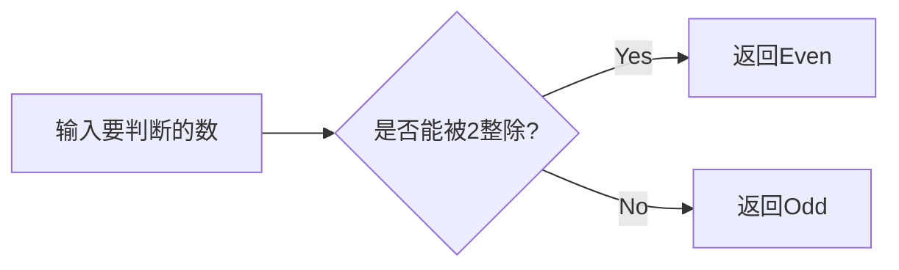

# 实验二 Python变量、简单数据类型

班级： 21计科4班

学号： B20210202307

姓名： 左莉

Github地址：<https://github.com/1128zl/git_python_practice>

CodeWars地址：<https://www.codewars.com/users/1128zl>

## 实验目的

1\. 使用VSCode编写和运行Python程序

2\. 学习Python变量和简单数据类型

## 实验环境

1\. Git

2\. Python 3.10

3\. VSCode

4\. VSCode插件

## 实验内容和步骤

### 第一部分

实验环境的安装

1\. 安装Python，从Python官网下载Python 3.10安装包，下载后直接点击可以安装：Python官网地址

2\. 为了在VSCode集成环境下编写和运行Python程序，安装下列VScode插件:

Python

Python Environment Manager

Python Indent

Python Extended

Python Docstring Generator

Jupyter

indent-rainbow

Jinja

### 第二部分

Python变量、简单数据类型和列表简介

完成教材《Python编程从入门到实践》下列章节的练习：

第2章 变量和简单数据类型

### 第三部分

在Codewars网站注册账号，完成下列Kata挑战：

#### 第1题：求离整数n最近的平方数（Find Nearest square number）

难度：8kyu

你的任务是找到一个正整数n的最近的平方数 例如，如果n=111，那么nearest_sq(n)（nearestSq(n)）等于121，因为111比100（10的平方）更接近121（11的平方）。 如果n已经是完全平方（例如n=144，n=81，等等），你需要直接返回n。 代码提交地址 <https://www.codewars.com/kata/5a805d8cafa10f8b930005ba>

#### 第2题：弹跳的球（Bouncing Balls）

难度：6kyu

一个孩子在一栋高楼的第N层玩球。这层楼离地面的高度h是已知的。他把球从窗口扔出去。球弹了起来, 例如:弹到其高度的三分之二（弹力为0.66）。他的母亲从离地面w米的窗户向外看,母亲会看到球在她的窗前经过多少次（包括球下落和反弹的时候）？

一个有效的实验必须满足三个条件：

参数 "h"（米）必须大于0

参数 "bounce "必须大于0且小于1

参数 “window "必须小于h。

如果以上三个条件都满足，返回一个正整数，否则返回-1。 注意:只有当反弹球的高度严格大于窗口参数时，才能看到球。

代码提交地址 <https://www.codewars.com/kata/5544c7a5cb454edb3c000047/train/python>

#### 第3题： 元音统计(Vowel Count)

难度： 7kyu

返回给定字符串中元音的数量（计数）。对于这个Kata，我们将考虑a、e、i、o、u作为元音（但不包括y）。输入的字符串将只由小写字母和/或空格组成。

代码提交地址： <https://www.codewars.com/kata/54ff3102c1bad923760001f3>

#### 第4题：偶数或者奇数（Even or Odd）

难度：8kyu

创建一个函数接收一个整数作为参数，当整数为偶数时返回”Even”当整数位奇数时返回”Odd”。 代码提交地址： <https://www.codewars.com/kata/53da3dbb4a5168369a0000fe>

### 第四部分

使用Mermaid绘制程序流程图

安装Mermaid的VSCode插件：

Markdown Preview Mermaid Support

Mermaid Markdown Syntax Highlighting

使用Markdown语法绘制你的程序绘制程序流程图（至少一个），Markdown代码如下：

程序流程图

```Markdown
flowchart TD
    A[Start] --> B{Is it?}
    B -->|Yes| C[OK]
    C --> D[Rethink]
    D --> B
    B ---->|No| E|End|
```

查看Mermaid流程图语法-->点击这里

使用Markdown编辑器（例如VScode）编写本次实验的实验报告，包括实验过程与结果、实验考查和实验总结，并将其导出为 PDF格式 来提交。

## 实验过程与结果

请将实验过程与结果放在这里，包括：

### 第二部分 Python变量、简单数据类型和列表简介

2.1

```python
# 给变量赋值并打印
message = "Hello Python world!"
print (message)

```

2.2

```python
# 给变量二次赋值并打印
message = "Hello Python world!"

message = "Hello Python Crash Course world!"
print (message)
```

2.3

```python
name="eric"
last_name="would you like to learn some Python today"
full_time=f"{name.title()} {last_name}"
# 将名字处理成首字母大写，其余字母小写，并和last_time进行连接
print(f"Hello, {full_time}?")
```

2.4

```python
name="jack"
# 全部大写
print(name.upper())
# 全部小写
print(name.lower())
# 首字母大写，其余小写
print(name.title())
```

2.5   2.6

```python
name ="albert einstein"
word ='"a person who never made a mistake never tried angthing new."'
print(f"{name.title()} once said, {word.title()}")
```

2.7

```python
name ="  helen  "
# 将前后端的空白删掉
print(name.strip())
# 换行缩进
print("his name is :\n\t"+ name.strip())
```

2.8

```python
filename ="python_notes.txt"
print(filename)
# 处理filename 将不想要显示的隐藏
filename_1=filename.removesuffix("txt")
print(filename_1)
```

2.9

```python
print(3+2)
print(3-2)
print(3*2)
print(3/2)
```

2.10

```python
number =19
string ="My favorite number is " +str(number)
print(string)
```

2.11

```python
# name:zl date:2023.10.7
# python语言打印hello git 语句
print("hello git")
```

2.12

```python
import  this
```

终端显示：

```python
The Zen of Python, by Tim Peters
```

### 第三部分 Codewars Kata挑战

第1题：

```python
def nearest_sq(n):
    # pass
    return round(n ** 0.5) ** 2
nearest_sq(111)

```

第2题：

```python
def bouncing_ball(h, bounce, window):
    # your code
    count=0
    if (h>0 and (bounce>0 and bounce <1) and window<h):
        while h > window:
            count += 1
            h *= bounce
            if h > window:
                 count += 1
        return count
    else :
        return -1

```

第3题：

```python
def get_count(sentence):
    count = 0
    for x in range(len(sentence)):
        if sentence[x] == 'a' or sentence[x] == 'e' or sentence[x] == 'i' or sentence[x] == 'o' or sentence[x] == 'u':
            count += 1
    return count

```

第4题：

```python
def even_or_odd(number):
    if (number % 2 ==1) :
        return "Odd"
    else :
        return "Even"

```

### 第四部分 使用Mermaid绘制程序流程图

Kata挑战第四题程序流程图：

Markdown代码：



注意代码需要使用markdown的代码块格式化，例如Git命令行语句应该使用下面的格式：

```bat
git init
git add .
git status
git commit -m "first commit"

```

显示效果如下：

```git
git init
git add .
git status
git commit -m "first commit"
```

如果是Python代码，应该使用下面代码块格式,显示效果如下：

```python
def add_binary(a,b):
    return bin(a+b)[2:]
```

代码运行结果的文本可以直接粘贴在这里。

注意：不要使用截图，Markdown文档转换为Pdf格式后，截图可能会无法显示。

## 实验考查

请使用自己的语言并使用尽量简短代码示例回答下面的问题，这些问题将在实验检查时用于提问和答辩以及实际的操作。

1\. Python中的简单数据类型有那些？我们可以对这些数据类型做哪些操作？

整数类型（基本操作：加法、减法、乘法、除法、取余等）

浮点数类型 （基本操作：加法、减法、乘法、除法、取余等）

字符串类型 （基本操作：字符串拼接、切片、长度计算等）

2\.为什么说Python中的变量都是标签？

在Python中，变量通常被描述为标签，因为它们实际上是指向对象的标识符或引用，而不是存储对象本身的容器。这种概念与某些其他编程语言不同，它们使用变量来表示内存中的存储位置，而Python中的变量实际上是对象的名称或标签。

3\.有哪些方法可以提高Python代码的可读性？

注释和文档字符串，模块化和函数抽象，使用空白行分隔代码块。

## 实验总结

本次实验中，对于python语言中的一些变量的不同打印和拼接有了进一步的了解。另外，对于python的一些特性能够更好地理解。对于这些知识点的掌握还需要多加练习。
